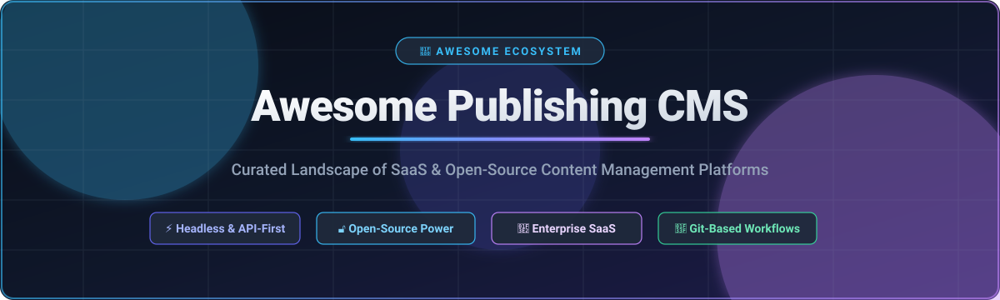

# 🚀 Awesome-Publishing-CMS

<div align="center">



<p align="center">
<a href="https://github.com/ishandutta2007/Awesome-Awesome-Awesome"></a><a href="https://discord.gg/jc4xtF58Ve"></a> <a href="https://github.com/ishandutta2007/Awesome-Publishing-CMS/stargazers"></a> <a href="https://github.com/ishandutta2007/Awesome-Publishing-CMS/network/members"></a> <a href="https://github.com/ishandutta2007/Awesome-Publishing-CMS/blob/main/LICENSE"></a> <a href="https://github.com/ishandutta2007"></a>
</p>

### 🌟 The Ultimate Curated Guide to Modern Publishing CMS, Headless Platforms & Editorial Infrastructure

**Curated list of enterprise SaaS platforms, hosted CMS solutions, API-first headless engines, and top open-source publishing systems.**
*Covering digital publishing, omnichannel delivery, structured content, editorial workflows, headless architecture, Jamstack, static site generators, and composable content management.*

📅 **Last updated: August 2026**
</div>

---

## 📖 Overview & Ecosystem Summary

Publishing CMS has evolved far beyond traditional monolithic website builders. Modern publishing platforms are designed for **omnichannel delivery, structured content modeling, collaborative editorial workflows, GraphQL/REST content APIs, digital asset management (DAM), localization, versioning, live preview, and personalization across websites, mobile apps, commerce channels, newsletters, and AI-powered interfaces**.

Whether evaluating scalable enterprise cloud solutions or self-hostable open-source frameworks, this guide tracks pricing, company scale, free-tier limits, and GitHub traction across the entire digital content ecosystem.

> 💡 **Important Distinction:** Some modern CMS products offer open-source cores while their hosted offerings are commercial (e.g. Strapi, Payload, Directus, Sanity Studio). Always evaluate based on the exact deployment edition, license, and repository.

---

## 📑 Table of Contents

* [🏢 SaaS / Hosted Platforms](#-saashosted-platforms)
  * [Enterprise Publishing CMS](#enterprise-publishing-cms)
  * [Headless Publishing Platforms](#headless-publishing-platforms)
  * [Digital Publishing & Editorial Platforms](#digital-publishing--editorial-platforms)
  * [Commerce & Product Publishing](#commerce--product-publishing)
* [🔓 Open-Source GitHub Projects](#-open-source-github-projects)
* [📚 Additional Open-Source Publishing CMS](#-additional-open-source-publishing-cms)
  * [Classic / Full-Stack CMS](#classic--full-stack-cms)
  * [Modern Headless CMS](#modern-headless-cms)
  * [Developer-Oriented CMS](#developer-oriented-cms)
  * [Git-Based CMS](#git-based-cms)
* [🌿 Git-Based Publishing CMS](#-git-based-publishing-cms)
* [🏛️ Enterprise Open-Source CMS](#-enterprise-open-source-cms)
* [⚡ Headless & API-First Open Source](#-headless--api-first-open-source)
* [🛠️ Publishing Infrastructure](#-publishing-infrastructure)
* [📊 Publishing CMS Capability Matrix](#-publishing-cms-capability-matrix)
* [⚖️ SaaS vs Open Source](#-saas-vs-open-source)
* [🌐 Commercial Platform vs Open-Source Ecosystem](#-commercial-platform-vs-open-source-ecosystem)
* [📁 Open-Source Projects by Publishing Function](#-open-source-projects-by-publishing-function)
* [⚡ Static / Documentation Publishing](#-static--documentation-publishing)
* [🏆 Recommended Open-Source Shortlist](#-recommended-open-source-shortlist)
* [🔮 The Biggest Open-Source Opportunities](#-the-biggest-open-source-opportunities)
* [📈 Star History](#-star-history)
* [🤝 How to Contribute](#-how-to-contribute)
* [📄 Disclaimer](#-disclaimer)

---

## 🏢 SaaS/Hosted Platforms

> 📊 **Market Size & Landscape Analysis:** The global Content Management System (CMS) market is estimated at **$26B–$35B in 2026** (projected to exceed $50B+ by 2030 at 7–14% CAGR). The sector is **moderately fragmented**: while legacy monolithic solutions (like WordPress) command significant global footprint, high-growth sub-segments—specifically composable headless CMS, enterprise Digital Experience Platforms (DXP), and newsletter publishing ecosystems—are fiercely contested by specialized venture-backed innovators and enterprise cloud suites rather than a single winner-take-all monopoly.

### Enterprise Publishing CMS

| Product | Description | Company Size / Valuation | Starting Price | Free Tier Limits |
| :--- | :--- | :--- | :--- | :--- |
| **Adobe Experience Manager** | Enterprise content management and digital experience platform supporting web content, assets, personalization, and large-scale publishing operations. | ~$108.7B market cap (~$23.8B rev) | ~$8,333/mo (approx. $100,000+/yr custom quote) | No free tier or trial (sales-assisted demo only) |
| **Sitecore** | Enterprise digital experience platform combining content management, personalization, analytics, commerce, and omnichannel publishing. | >$500M ARR (raised $1.2B+) | ~$4,166/mo (approx. $50,000+/yr custom quote) | No standard platform free trial (limited trial for Sitecore Connect module / sales POC only) |
| **WordPress VIP** | Enterprise managed WordPress platform focused on high-scale publishing, content operations, security, governance, performance, and omnichannel delivery. Particularly relevant to large publishers, media organizations, enterprises, and high-traffic digital properties. | ~$3.3B valuation (Automattic) | ~$2,000/mo (approx. $25,000/yr custom quote) | No free tier or trial (custom demo only) |
| **Contentful** | API-first composable content platform for structured content and omnichannel publishing. Strong ecosystem of APIs, integrations, localization, editorial workflows, and enterprise content operations. | ~$1.25B valuation (Salesforce acquisition) | $300/mo (Team plan) | **Free forever**: 1 space, 10 users, 25 content models, 2 locales, 100,000 API calls/mo, 50 GB bandwidth/mo |
| **Contentstack** | Enterprise-grade headless CMS and DXP platform supporting complex content models, localization, workflows, governance, and omnichannel digital experiences. | ~$782M valuation (estimated) | ~$1,666/mo (approx. $20,000/yr custom quote) | **Free developer tier**: Free Explorer account for solo developers/learning + 14-day free trial |
| **Brightspot** | Enterprise CMS and digital experience platform used by publishers, media organizations, and large content operations. Supports editorial workflows, content modeling, personalization, DAM, and omnichannel delivery. | ~$24M ARR (raised $22M) | Custom quote | **Free trial**: 30-day free trial upon request (no permanent free tier) |
| **Agility CMS** | Headless CMS combining structured content management with page management, visual editing, digital asset management, and omnichannel delivery. | ~$2.9M ARR (bootstrapped) | $699/mo (Essentials plan) | **Free forever POC plan**: 5 users, 25,000 entries, unlimited API requests & content models |

### Headless Publishing Platforms

| Product | Description | Company Size / Valuation | Starting Price | Free Tier Limits |
| :--- | :--- | :--- | :--- | :--- |
| **Storyblok** | Headless CMS with a strong visual-editor experience. Combines structured content, reusable components, visual editing, workflows, localization, APIs, and omnichannel delivery. Particularly attractive to marketing-led publishing teams. | ~$80M ARR (raised $138M) | $99/mo per space (Growth plan) | **Free forever (Starter)**: 1 space, 1 user seat, 3 publishes/day limit, 1,000,000 API requests/mo, unlimited content entries |
| **Sanity** | Structured-content platform with real-time collaboration, highly customizable content modeling, APIs, Portable Text, and a developer-centric Studio. Strong fit for complex publishing applications and custom editorial experiences. | ~$88M valuation (raised $52M) | $15/seat/mo (Growth plan) | **Free forever**: 20 user seats, unlimited projects, 2 datasets, 10,000 documents/dataset, 1M API requests/mo, 100 GB storage & bandwidth/mo |
| **Strapi Cloud** | Hosted version of the Strapi ecosystem. Provides managed infrastructure while retaining the developer-oriented Strapi content modeling and API approach. | ~$49M funding (~$10M ARR) | $15/mo (Essential plan) | **Free forever**: Hobby tier for MVPs/evaluations (or self-hosted open-source Community Edition) |
| **Hygraph** | GraphQL-native headless CMS supporting structured content, content federation, localization, editorial workflows, and omnichannel publishing. Particularly useful when content needs to combine multiple external sources through a unified content API. | ~$45M funding (~$8.1M rev) | $199/mo (Growth plan) | **Free forever (Hobby)**: 3 user seats, 1,000 entries/records, 10 components, 2 locales, 500,000 API calls/mo, 50 MB max upload size |
| **Kontent.ai** | Enterprise headless CMS focused on structured content, content operations, collaboration, localization, and omnichannel publishing. | ~$40M funding (~$15.7M ARR) | ~$1,249/mo (Scale plan estimate) / Custom quote | **Free forever Developer Plan**: 1 user, 2 languages, 200,000 API calls/mo, 2 GB asset storage, 10 GB bandwidth/mo + 30-day free trial |
| **Prismic** | Headless CMS centered around its slice-based content architecture. Strong fit for marketing sites, editorial publishing, reusable page components, localization, and modern JavaScript frameworks. | ~$15M ARR (bootstrapped) | $10/mo per repository (Starter plan) | **Free forever**: 1 user seat, 1 repository, 2 locales, 100,000 API calls/mo |
| **ButterCMS** | Hosted headless CMS emphasizing rapid integration, blogging, marketing content, page management, and publishing APIs. Designed to reduce CMS infrastructure requirements for development teams. | ~$1.8M rev (bootstrapped) | $71/mo (Micro plan billed annually) | **Free forever**: Unlimited users, 5 pages, 50 blog posts, 50 collections, 500 assets, 50,000 API calls/mo, 100 GB bandwidth + 14-day free trial |
| **DatoCMS** | API-first headless CMS focused on structured content, editorial workflows, media, localization, and high-performance publishing. | ~$1.3M ARR (bootstrapped) | €149/mo (Professional plan billed annually) | **Free forever**: 2 editors, 300 records, 100,000 CDA API calls/mo, 25,000 CMA API calls/mo, 10 GB bandwidth/mo |

### Digital Publishing & Editorial Platforms

| Product | Description | Company Size / Valuation | Starting Price | Free Tier Limits |
| :--- | :--- | :--- | :--- | :--- |
| **HubSpot Content Hub** | Enterprise content platform combining CMS, marketing automation, personalization, analytics, and content operations. | ~$11.85B market cap (~$2.6B rev) | $10/seat/mo (Starter plan) | **Free forever**: 2 users, 1,000 contacts, 2,000 marketing emails/mo, basic CMS pages with HubSpot branding + 14-day trial |
| **Webflow CMS** | Hosted visual website and content-management platform combining design, CMS, publishing, and hosting. | ~$4.0B valuation (~$100M+ ARR) | $25/mo (Premium Site plan billed annually) | **Free forever (Starter plan)**: 2 static pages, 50 CMS items, 20 collections, 1 GB bandwidth, `webflow.io` subdomain |
| **Optimizely CMS** | Enterprise CMS and digital experience platform supporting content management, experimentation, personalization, and publishing workflows. | ~$1.16B valuation (~$400M ARR) | ~$2,500/mo (approx. $30,000+/yr custom quote) | No standard CMS free trial (Optimizely Rollouts free tier / sales POC demo only) |
| **Substack** | Hosted publishing and newsletter platform supporting subscription-based editorial businesses and independent publishers. | ~$1.1B valuation (raised $190M) | Free (10% cut on paid subscription revenue only) | **Free forever**: Unlimited subscribers, unlimited newsletter email sends, web publishing, audience growth tools |
| **Beehiiv** | Newsletter and publication platform focused on audience growth, publishing, monetization, analytics, and newsletter operations. | ~$180M valuation (raised $49M) | $43/mo (Scale plan billed annually) | **Free forever (Launch plan)**: Up to 2,500 subscribers, unlimited email sends, custom domain web publication |
| **Ghost(Pro)** | Managed publishing platform based on the Ghost open-source publishing system. Particularly focused on publications, newsletters, memberships, subscriptions, creators, and independent media. | ~$8.5M+ annual revenue (non-profit) | $15/mo (Starter plan billed annually) | **Free trial**: 14-day full-featured free trial (no credit card required; no permanent hosted free tier) |

### Commerce & Product Publishing

| Product | Description | Company Size / Valuation | Starting Price | Free Tier Limits |
| :--- | :--- | :--- | :--- | :--- |
| **Contentful** | Frequently used for structured product content and composable commerce architectures. | ~$1.25B valuation (Salesforce acquisition) | $300/mo (Team plan) | **Free forever**: 1 space, 10 users, 25 content models, 2 locales, 100,000 API calls/mo, 50 GB bandwidth/mo |
| **Storyblok** | Strong fit for commerce and marketing teams requiring visual content composition. | ~$80M ARR (raised $138M) | $99/mo per space (Growth plan) | **Free forever (Starter)**: 1 space, 1 user seat, 3 publishes/day limit, 1,000,000 API requests/mo, unlimited content entries |
| **Sanity** | Frequently deployed for product catalogs, editorial content, commerce experiences, and structured publishing. | ~$88M valuation (raised $52M) | $15/seat/mo (Growth plan) | **Free forever**: 20 user seats, unlimited projects, 2 datasets, 10,000 documents/dataset, 1M API requests/mo, 100 GB storage & bandwidth/mo |
| **Hygraph** | Particularly useful for content federation and product/content aggregation. | ~$45M funding (~$8.1M rev) | $199/mo (Growth plan) | **Free forever (Hobby)**: 3 user seats, 1,000 entries/records, 10 components, 2 locales, 500,000 API calls/mo, 50 MB max upload size |
| **Builder.io** | Visual headless CMS and composable experience platform for marketers and developers. Strong emphasis on visual page building, experimentation, personalization, and component-driven publishing. | ~$37.3M funding (Series B led by M12) | $24/user/mo (Fusion Pro) / $39/user/mo (Publish Pro) | **Free forever**: 5 users per space, 75 monthly AI Agent credits (max 25/day), visual editor & basic integrations |

---

## 🔓 Open-Source GitHub Projects

The most prominent open-source publishing and content-management repositories on GitHub, ordered by community popularity (stars descending):

### Strapi

* **[Strapi](https://github.com/strapi/strapi)** [](https://github.com/strapi/strapi/stargazers)

  * Leading open-source headless CMS built on Node.js and TypeScript.
  * Provides customizable content modeling, REST APIs, GraphQL, customizable administration UI, RBAC permissions, and media management.
  * Features a massive plugin ecosystem and strong developer adoption for multi-channel content architectures.

### Ghost

* **[Ghost](https://github.com/TryGhost/Ghost)** [](https://github.com/TryGhost/Ghost/stargazers)

  * Modern open-source publishing platform focused on professional journalism, newsletters, memberships, and paid subscriptions.
  * Built with Node.js, featuring a clean visual editor, native email newsletter delivery, member management, and customizable themes.
  * Particularly popular among independent writers, creator businesses, media publishers, and editorial teams.

### Payload CMS

* **[Payload CMS](https://github.com/payloadcms/payload)** [](https://github.com/payloadcms/payload/stargazers)

  * Open-source TypeScript-first headless CMS and fullstack application framework.
  * Deeply integrated with Next.js and React Server Components, offering Local API, REST, GraphQL, authentication, and custom admin panels.
  * Developer favorite for embedding content management directly into modern Next.js and fullstack web applications.

### Outline

* **[Outline](https://github.com/outline/outline)** [](https://github.com/outline/outline/stargazers)

  * Modern, open-source knowledge base, team wiki, and collaborative document publishing platform.
  * Built with Node.js and React, featuring real-time collaborative editing, Markdown support, granular permissions, and integrations with Slack/Figma.
  * Ideal for team documentation, internal publishing, structured knowledge sharing, and enterprise wikis.

### Directus

* **[Directus](https://github.com/directus/directus)** [](https://github.com/directus/directus/stargazers)

  * Open-source data engine and headless CMS that connects directly to SQL databases (PostgreSQL, MySQL, SQLite, Oracle).
  * Instantly reflects existing database schemas with auto-generated REST and GraphQL APIs without vendor lock-in.
  * Includes a dynamic admin app, extensible flows, granular role-based permissions, and media asset management.

### WordPress

* **[WordPress](https://github.com/WordPress/WordPress)** [](https://github.com/WordPress/WordPress/stargazers)

  * The world's most widely deployed open-source publishing CMS, powering over 40% of the web.
  * Supports blogs, digital publications, enterprise websites, custom post types, Gutenberg block editor, and full-site editing.
  * Features a vast global ecosystem of themes, plugins, REST APIs, and GraphQL support for traditional and headless setups.

### Wagtail

* **[Wagtail](https://github.com/wagtail/wagtail)** [](https://github.com/wagtail/wagtail/stargazers)

  * Leading open-source CMS built on Python and the Django framework.
  * Renowned for its clean StreamField editorial experience, structured content modeling, fast performance, and enterprise security.
  * Widely chosen by higher education, media organizations, governments, and Python/Django development teams worldwide.

### Decap CMS

* **[Decap CMS](https://github.com/decaporg/decap-cms)** [](https://github.com/decaporg/decap-cms/stargazers)

  * Open-source Git-based content management system for static site generators (formerly Netlify CMS).
  * Enables non-technical editorial teams to edit Markdown, YAML, and JSON content with Git commits under the hood.
  * Single-page React application that lives directly within your web project repository with zero server overhead.

### TinaCMS

* **[TinaCMS](https://github.com/tinacms/tinacms)** [](https://github.com/tinacms/tinacms/stargazers)

  * Open-source Git-backed headless CMS with visual inline editing and Markdown/MDX support.
  * Stores content directly in GitHub/GitLab repositories while providing live contextual preview in React/Next.js applications.
  * Excellent choice for developer-driven teams looking for Git-backed publishing workflows with visual editing capabilities.

### KeystoneJS

* **[KeystoneJS](https://github.com/keystonejs/keystone)** [](https://github.com/keystonejs/keystone/stargazers)

  * Open-source Node.js and TypeScript framework for schema-driven content platforms and headless CMS.
  * Automatically generates a powerful GraphQL API and custom React admin interface from TypeScript schemas.
  * Supports custom field types, session management, access control, and seamless database migrations with Prisma.

### Webiny

* **[Webiny](https://github.com/webiny/webiny-js)** [](https://github.com/webiny/webiny-js/stargazers)

  * Enterprise open-source serverless headless CMS built on AWS (Lambda, DynamoDB, S3, CloudFront).
  * Features multi-tenancy, page builder, form builder, headless CMS with GraphQL API, and file manager.
  * Designed specifically for high-scale enterprise cloud infrastructure with elastic scaling and serverless cost efficiency.

### Joomla

* **[Joomla](https://github.com/joomla/joomla-cms)** [](https://github.com/joomla/joomla-cms/stargazers)

  * Mature, award-winning open-source CMS built in PHP.
  * Offers powerful native multilingual support, flexible user access control (ACL), content workflows, and custom fields.
  * Extensive community ecosystem with thousands of extensions and templates for publishing websites and corporate portals.

### ApostropheCMS

* **[ApostropheCMS](https://github.com/apostrophecms/apostrophe)** [](https://github.com/apostrophecms/apostrophe/stargazers)

  * Open-source Node.js full-stack and headless CMS combining in-context drag-and-drop page editing with REST/GraphQL APIs.
  * Features visual page layout building, piece types, localization, draft/publish workflows, and modular architecture.
  * A developer-friendly choice for creative agencies and enterprise teams wanting real-time on-page visual editing.

### Drupal

* **[Drupal](https://github.com/drupal/drupal)** [](https://github.com/drupal/drupal/stargazers)

  * Enterprise-grade open-source CMS and digital experience platform built with PHP and Symfony.
  * Industry standard for complex taxonomy, structured content modeling, advanced editorial workflows, multi-site governance, and multilingual publishing.
  * Heavily utilized by Fortune 500 enterprises, government agencies, universities, and large global publishers.

### Squidex

* **[Squidex](https://github.com/squidex/squidex)** [](https://github.com/squidex/squidex/stargazers)

  * Open-source, high-performance headless CMS and content federation hub built on .NET Core and MongoDB.
  * Supports GraphQL and REST APIs, complex content schemas, rule engines, content validation, and localization.
  * Deployable via Docker/Kubernetes on any cloud or on-premise infrastructure for cross-platform content delivery.

### TYPO3

* **[TYPO3](https://github.com/TYPO3/typo3)** [](https://github.com/TYPO3/typo3/stargazers)

  * Enterprise open-source CMS recognized across Europe for enterprise governance and massive multisite installations.
  * Features native multilingual capabilities, granular permissions, complex editorial publishing workflows, and long-term enterprise support.
  * Optimized for high-traffic corporate portals, governmental sites, and multinational organizations.

### Concrete CMS

* **[Concrete CMS](https://github.com/concretecms/concretecms)** [](https://github.com/concretecms/concretecms/stargazers)

  * Open-source CMS designed with intuitive point-and-click inline editing for content editors.
  * Includes built-in permission management, file managers, multilingual site tools, and forms.
  * Powers major corporate, non-profit, and government publishing websites seeking ease of editing without sacrificing control.

### Plone

* **[Plone](https://github.com/plone/Products.CMFPlone)** [](https://github.com/plone/Products.CMFPlone/stargazers)

  * Battle-tested, enterprise-grade Python CMS built on Zope with a 20+ year track record in high-security environments.
  * Offers unparalleled security record, fine-grained access control, workflow orchestration, and out-of-the-box multilingual capabilities.
  * Extensively deployed in government agencies, scientific institutions, universities, and enterprise organizations worldwide.

---

## 📚 Additional Open-Source Publishing CMS

### Classic / Full-Stack CMS

* **[WordPress](https://github.com/WordPress/WordPress)** [](https://github.com/WordPress/WordPress/stargazers)
* **[Grav](https://github.com/getgrav/grav)** [](https://github.com/getgrav/grav/stargazers)
* **[October CMS](https://github.com/octobercms/october)** [](https://github.com/octobercms/october/stargazers)
* **[Umbraco](https://github.com/umbraco/Umbraco-CMS)** [](https://github.com/umbraco/Umbraco-CMS/stargazers)
* **[Joomla](https://github.com/joomla/joomla-cms)** [](https://github.com/joomla/joomla-cms/stargazers)
* **[Drupal](https://github.com/drupal/drupal)** [](https://github.com/drupal/drupal/stargazers)
* **[Pimcore](https://github.com/pimcore/pimcore)** [](https://github.com/pimcore/pimcore/stargazers)
* **[Craft CMS](https://github.com/craftcms/cms)** [](https://github.com/craftcms/cms/stargazers)
* **[Microweber](https://github.com/microweber/microweber)** [](https://github.com/microweber/microweber/stargazers)
* **[Winter CMS](https://github.com/wintercms/winter)** [](https://github.com/wintercms/winter/stargazers)
* **[MODX](https://github.com/modxcms/revolution)** [](https://github.com/modxcms/revolution/stargazers)
* **[TYPO3](https://github.com/TYPO3/typo3)** [](https://github.com/TYPO3/typo3/stargazers)
* **[ProcessWire](https://github.com/processwire/processwire)** [](https://github.com/processwire/processwire/stargazers)
* **[Backdrop CMS](https://github.com/backdrop/backdrop)** [](https://github.com/backdrop/backdrop/stargazers)
* **[Textpattern](https://github.com/textpattern/textpattern)** [](https://github.com/textpattern/textpattern/stargazers)
* **[Concrete CMS](https://github.com/concretecms/concretecms)** [](https://github.com/concretecms/concretecms/stargazers)
* **[SilverStripe](https://github.com/silverstripe/silverstripe-cms)** [](https://github.com/silverstripe/silverstripe-cms/stargazers)
* **[ExpressionEngine](https://github.com/ExpressionEngine/ExpressionEngine)** [](https://github.com/ExpressionEngine/ExpressionEngine/stargazers)
* **[Plone](https://github.com/plone/Products.CMFPlone)** [](https://github.com/plone/Products.CMFPlone/stargazers)

### Modern Headless CMS

* **[Strapi](https://github.com/strapi/strapi)** [](https://github.com/strapi/strapi/stargazers)
* **[Payload CMS](https://github.com/payloadcms/payload)** [](https://github.com/payloadcms/payload/stargazers)
* **[Directus](https://github.com/directus/directus)** [](https://github.com/directus/directus/stargazers)
* **[Decap CMS](https://github.com/decaporg/decap-cms)** [](https://github.com/decaporg/decap-cms/stargazers)
* **[TinaCMS](https://github.com/tinacms/tinacms)** [](https://github.com/tinacms/tinacms/stargazers)
* **[KeystoneJS](https://github.com/keystonejs/keystone)** [](https://github.com/keystonejs/keystone/stargazers)
* **[Webiny](https://github.com/webiny/webiny-js)** [](https://github.com/webiny/webiny-js/stargazers)
* **[Sanity Studio](https://github.com/sanity-io/sanity)** [](https://github.com/sanity-io/sanity/stargazers)
* **[ApostropheCMS](https://github.com/apostrophecms/apostrophe)** [](https://github.com/apostrophecms/apostrophe/stargazers)
* **[Twill](https://github.com/area17/twill)** [](https://github.com/area17/twill/stargazers)
* **[Pages CMS](https://github.com/pages-cms/pages-cms)** [](https://github.com/pages-cms/pages-cms/stargazers)
* **[Squidex](https://github.com/squidex/squidex)** [](https://github.com/squidex/squidex/stargazers)
* **[Cockpit CMS](https://github.com/cockpit-hq/cockpit)** [](https://github.com/cockpit-hq/cockpit/stargazers)
* **[Static CMS](https://github.com/StaticJsCMS/static-cms)** [](https://github.com/StaticJsCMS/static-cms/stargazers)

### Developer-Oriented CMS

* **[Strapi](https://github.com/strapi/strapi)** [](https://github.com/strapi/strapi/stargazers)
* **[Payload CMS](https://github.com/payloadcms/payload)** [](https://github.com/payloadcms/payload/stargazers)
* **[Outline](https://github.com/outline/outline)** [](https://github.com/outline/outline/stargazers)
* **[Directus](https://github.com/directus/directus)** [](https://github.com/directus/directus/stargazers)
* **[Wagtail](https://github.com/wagtail/wagtail)** [](https://github.com/wagtail/wagtail/stargazers)
* **[Decap CMS](https://github.com/decaporg/decap-cms)** [](https://github.com/decaporg/decap-cms/stargazers)
* **[TinaCMS](https://github.com/tinacms/tinacms)** [](https://github.com/tinacms/tinacms/stargazers)
* **[KeystoneJS](https://github.com/keystonejs/keystone)** [](https://github.com/keystonejs/keystone/stargazers)
* **[Webiny](https://github.com/webiny/webiny-js)** [](https://github.com/webiny/webiny-js/stargazers)
* **[ApostropheCMS](https://github.com/apostrophecms/apostrophe)** [](https://github.com/apostrophecms/apostrophe/stargazers)
* **[Squidex](https://github.com/squidex/squidex)** [](https://github.com/squidex/squidex/stargazers)

### Git-Based CMS

* **[Decap CMS](https://github.com/decaporg/decap-cms)** [](https://github.com/decaporg/decap-cms/stargazers)
* **[TinaCMS](https://github.com/tinacms/tinacms)** [](https://github.com/tinacms/tinacms/stargazers)
* **[Pages CMS](https://github.com/pages-cms/pages-cms)** [](https://github.com/pages-cms/pages-cms/stargazers)
* **[Static CMS](https://github.com/StaticJsCMS/static-cms)** [](https://github.com/StaticJsCMS/static-cms/stargazers)

---

## 🌿 Git-Based Publishing CMS

Git-backed publishing is a robust alternative to database-centric CMS architectures, treating content as code with pull requests, version history, automated testing, and CI/CD deployment:

```text
                         GIT REPOSITORY
                               │
                ┌──────────────┼──────────────┐
                │              │              │
             Markdown        MDX           YAML/JSON
                │              │              │
                └──────────────┼──────────────┘
                               │
                      ┌─────────▼─────────┐
                      │   Git CMS Layer   │
                      ├───────────────────┤
                      │ TinaCMS           │
                      │ Decap CMS         │
                      │ Pages CMS         │
                      │ Static CMS        │
                      └─────────┬─────────┘
                                │
                          Git Commit
                                │
                                ▼
                         CI/CD Pipeline
                                │
                ┌──────────────┼──────────────┐
                │              │              │
               Vercel        Netlify         Cloudflare
                │              │              │
                └──────────────┼──────────────┘
                                │
                          Published Site
```

This architecture is especially attractive for:

* 📚 Documentation & developer portals
* ✍️ Technical blogs & engineering publications
* 🚀 Static marketing websites & landing pages
* 🌐 Open-source project sites
* 🛡️ Version-controlled editorial content
* 👥 Small-to-medium publishing and documentation teams

---

## 🏛️ Enterprise Open-Source CMS

For enterprise-grade publishing with complex workflows, multilingual delivery, and high security:

| Platform | GitHub Stars | Primary Strength |
| :--- | :--- | :--- |
| **Strapi** | [](https://github.com/strapi/strapi/stargazers) | Headless / API-first composable publishing |
| **Payload CMS** | [](https://github.com/payloadcms/payload/stargazers) | TypeScript-first Next.js enterprise applications |
| **Directus** | [](https://github.com/directus/directus/stargazers) | Database-first real-time content management |
| **WordPress** | [](https://github.com/WordPress/WordPress/stargazers) | Massive global ecosystem and editorial flexibility |
| **Wagtail** | [](https://github.com/wagtail/wagtail/stargazers) | Python / Django enterprise structured publishing |
| **Drupal** | [](https://github.com/drupal/drupal/stargazers) | Structured enterprise content, taxonomy & complex ACL |
| **Pimcore** | [](https://github.com/pimcore/pimcore/stargazers) | Unified CMS + DAM + PIM + Digital Commerce |
| **Squidex** | [](https://github.com/squidex/squidex/stargazers) | Headless structured content federation (.NET Core) |
| **TYPO3** | [](https://github.com/TYPO3/typo3/stargazers) | Enterprise multisite & multilingual governance |
| **ApostropheCMS** | [](https://github.com/apostrophecms/apostrophe/stargazers) | In-context visual editing + developer extensibility |
| **Plone** | [](https://github.com/plone/Products.CMFPlone/stargazers) | Top-tier security, workflow orchestration and compliance |

---

## ⚡ Headless & API-First Open Source

Modern digital publishing decouples content authors from frontend presentation layers:

```text
                     CONTENT AUTHORS
                            │
                            ▼
                     ┌──────────────┐
                     │    CMS       │
                     │              │
                     │ Strapi       │
                     │ Directus     │
                     │ Payload      │
                     │ Wagtail      │
                     │ Drupal       │
                     └──────┬───────┘
                            │
                     REST / GraphQL
                            │
              ┌─────────────┼─────────────┐
              │             │             │
              ▼             ▼             ▼
            Web           Mobile        Commerce
              │             │             │
              └─────────────┼─────────────┘
                            │
                            ▼
                        END USERS
```

This architecture allows a single content backend to simultaneously power:

* 🌐 Multi-brand websites & microsites
* 📱 Native mobile applications (iOS & Android)
* 📺 Smart TVs & digital signage
* 🛍️ Composable e-commerce storefronts
* 📧 Automated newsletters & email campaigns
* 🤖 AI assistants, LLM RAG pipelines & knowledge agents
* 📟 Digital kiosks & IoT interfaces
* 📖 Developer documentation & public API portals

---

## 🛠️ Publishing Infrastructure

A complete open-source publishing stack combines content engines, media pipelines, database infrastructure, frontend frameworks, and edge delivery:

```text
                         PUBLISHING STACK
                               │
        ┌──────────────────────┼──────────────────────┐
        │                      │                      │
     CONTENT                 MEDIA                  DATA
        │                      │                      │
     Strapi                Immich*                 PostgreSQL
     Directus              MinIO                   MySQL
     Payload               ImageMagick             SQLite
     Drupal                FFmpeg
        │                      │
        └──────────────────────┼──────────────────────┘
                               │
                          API / GraphQL
                               │
                               ▼
                        APPLICATION LAYER
                               │
               ┌────────────────┼────────────────┐
               │                │                │
             Next.js          Astro            Nuxt
               │                │                │
               └────────────────┼────────────────┘
                                │
                                ▼
                           CDN / EDGE
                                │
               ┌────────────────┼────────────────┐
               │                │                │
            Cloudflare        Varnish           Nginx
               │                │                │
               └────────────────┼────────────────┘
                                │
                                ▼
                            READERS
```

\* *Media-management tools should be evaluated separately based on specific DAM and asset transformation requirements.*

---

## 📊 Publishing CMS Capability Matrix

| Capability | SaaS / Hosted Platforms | Open-Source Options |
| :--- | :--- | :--- |
| **Traditional CMS** | WordPress VIP, Content Hub, AEM | WordPress, Drupal, Joomla, TYPO3 |
| **Headless CMS** | Contentful, Sanity, Storyblok, Hygraph | Strapi, Directus, Payload, Keystone |
| **Visual Editing** | Storyblok, Agility, Webflow | WordPress, ApostropheCMS, Concrete CMS, Wagtail |
| **Structured Content** | Contentful, Sanity, Hygraph | Strapi, Directus, Payload, Drupal |
| **GraphQL Support** | Hygraph, Contentful, Sanity | Strapi, Directus, Payload, Keystone, Squidex |
| **REST API** | Most modern SaaS CMS | Strapi, Directus, Payload, Drupal, WordPress |
| **Editorial Workflows** | Contentstack, Contentful, AEM | Drupal, WordPress, TYPO3, Plone |
| **Multilingual Content** | Contentful, Contentstack, Storyblok | Drupal, TYPO3, WordPress, Plone |
| **Localization** | Contentful, Sanity, Contentstack | Drupal, TYPO3, Strapi |
| **Media Management** | Contentful, Contentstack, AEM | Drupal, WordPress, Pimcore |
| **Digital Asset Management (DAM)** | AEM, Contentstack ecosystem | Pimcore, Drupal ecosystem |
| **Blog & Article Publishing** | ButterCMS, Ghost(Pro) | Ghost, WordPress |
| **Newsletter Publishing** | Substack, Beehiiv | Ghost |
| **Memberships & Subscriptions** | Ghost, WordPress ecosystems | Ghost, WordPress |
| **Git-Based Content** | Limited | TinaCMS, Decap CMS, Static CMS, Pages CMS |
| **Self-Hosting Freedom** | Limited | Strong |
| **Database Ownership** | Vendor-managed | Full ownership |
| **Source Code Access** | Proprietary | 100% Open Source |
| **Vendor Lock-in Risk** | Medium–High | Minimal / Portable |
| **Custom Extensibility** | APIs / webhooks | Unrestricted source-level code |
| **Enterprise Support** | Included in SLAs | Vendor / Agency ecosystem |
| **AI Integration** | Native cloud features | Modular LLM / RAG / custom agents |
| **Cost Predictability** | Subscription tiers | Infrastructure + engineering |

---

## ⚖️ SaaS vs Open Source

### 🏢 Commercial / SaaS Platforms

**Best suited for teams requiring:**
* 🚀 Managed cloud infrastructure & automatic scaling
* 🛡️ Enterprise SLAs, SOC 2 / ISO 27001 compliance
* 🔄 Vendor-managed zero-downtime updates
* 👥 Pre-built editorial approval workflows & governance
* 🌐 Global CDN edge delivery out of the box
* ⏱️ Minimal dedicated DevOps / infrastructure maintenance

**Leading platforms:** WordPress VIP, Contentful, Storyblok, Prismic, Sanity, Hygraph, ButterCMS, Contentstack, Agility CMS, DatoCMS, Brightspot, Kontent.ai, Adobe Experience Manager.

### 🔓 Open-Source Publishing Platforms

**Best suited for teams requiring:**
* 💻 100% source code access & local development environments
* 🏠 On-premise, air-gapped, or sovereign cloud hosting
* 💾 Complete database ownership without external telemetry
* 🧩 Deep native integration with web frameworks (Next.js, Django, Laravel, Symfony)
* 💸 Predictable cost structure immune to SaaS seat/API overages
* 🔓 Zero vendor lock-in with open data formats

**Leading platforms:** WordPress, Drupal, Ghost, Wagtail, Strapi, Directus, Payload CMS, KeystoneJS, Outline, TinaCMS, Decap CMS, Webiny, Squidex, ApostropheCMS, Plone, TYPO3, Joomla, Concrete CMS.

---

## 🌐 Commercial Platform vs Open-Source Ecosystem

```text
                     COMMERCIAL SAAS PUBLISHING
                                │
               ┌────────────────┼────────────────┐
               │                │                │
            Content          Workflow          Media
               │                │                │
               ▼                ▼                ▼
          Contentful       Contentstack         AEM
          Storyblok        WordPress VIP     Brightspot
          Sanity           Agility            Sitecore
               │                │                │
               └────────────────┼────────────────┘
                                │
                          Managed Cloud
                                │
                                ▼
                             Readers
```

The open-source ecosystem is composable and modular:

```text
                     OPEN-SOURCE PUBLISHING
                               │
           ┌───────────────────┼───────────────────┐
           │                   │                   │
        CMS CORE           CONTENT API           MEDIA
           │                   │                   │
       WordPress            Strapi                Pimcore
       Drupal               Directus              MinIO
       Wagtail              Payload               FFmpeg
       Ghost                Keystone
           │                   │
           └───────────────────┼───────────────────┘
                               │
                            FRONTEND
                               │
                 ┌─────────────┼─────────────┐
                 │             │             │
               Next.js       Astro         Nuxt
                 │             │             │
                 └─────────────┼─────────────┘
                               │
                              CDN
                               │
                               ▼
                             USERS
```

---

## 📁 Open-Source Projects by Publishing Function

| Publishing Function | Strong Open-Source Projects |
| :--- | :--- |
| **Traditional Publishing** | WordPress, Drupal, Joomla, Concrete CMS |
| **Enterprise CMS** | Drupal, TYPO3, Plone, Wagtail, Pimcore |
| **Headless CMS** | Strapi, Directus, Payload CMS, KeystoneJS, Squidex, Webiny |
| **Knowledge Base & Team Wiki** | Outline, BookStack |
| **Blog & Editorial Publishing** | Ghost, WordPress |
| **Newsletter Publishing** | Ghost |
| **Git-Based Publishing** | Decap CMS, TinaCMS, Pages CMS, Static CMS |
| **Visual Page Building** | WordPress (Gutenberg), ApostropheCMS, Concrete CMS, Wagtail |
| **Structured Content** | Strapi, Directus, Payload CMS, Drupal |
| **API-First Content Delivery** | Strapi, Directus, Payload CMS, Squidex |
| **GraphQL Content API** | Strapi, Directus, Payload CMS, KeystoneJS, Squidex, Webiny |
| **Multilingual Publishing** | Drupal, TYPO3, WordPress, Plone, Joomla |
| **Editorial Workflows & Governance** | Drupal, Plone, TYPO3, WordPress, Wagtail |
| **Digital Asset Management (DAM)** | Pimcore, Drupal ecosystem |
| **Ecommerce Content** | WordPress/WooCommerce, Pimcore, Drupal |
| **Technical Documentation** | Docusaurus, MkDocs, Astro, Hugo, VitePress, Nextra |
| **Static Site Publishing** | Hugo, Astro, Jekyll, Eleventy, Zola |
| **Developer Portals** | Docusaurus, MkDocs, Backstage |
| **Content Search Engines** | OpenSearch, Elasticsearch, Meilisearch, Typesense |
| **Image Processing** | ImageMagick, Sharp, libvips |
| **Video Processing** | FFmpeg |
| **Object Storage** | MinIO |
| **Database Engines** | PostgreSQL, MySQL, MariaDB, SQLite |
| **CDN / Reverse Proxy / Edge** | Nginx, Varnish, OpenResty, Caddy |
| **Authentication & IAM** | Keycloak, Authentik |
| **Privacy-First Analytics** | Matomo, Plausible, Umami |

---

## ⚡ Static / Documentation Publishing

For technical publishing, software documentation, and developer portals, static and Git-backed site generators provide blistering speed and zero database attack surface:

* **[Hugo](https://github.com/gohugoio/hugo)** [](https://github.com/gohugoio/hugo/stargazers)
  * Extremely fast static-site generator written in Go.

* **[Docusaurus](https://github.com/facebook/docusaurus)** [](https://github.com/facebook/docusaurus/stargazers)
  * Modern open-source documentation framework built on React and MDX by Meta.

* **[Astro](https://github.com/withastro/astro)** [](https://github.com/withastro/astro/stargazers)
  * Modern content-driven web framework with islands architecture and native Content Collections.

* **[Jekyll](https://github.com/jekyll/jekyll)** [](https://github.com/jekyll/jekyll/stargazers)
  * Blog-aware, battle-tested static site generator in Ruby powering GitHub Pages.

* **[MkDocs](https://github.com/mkdocs/mkdocs)** [](https://github.com/mkdocs/mkdocs/stargazers)
  * Fast and simple project documentation generator written in Python and configured via YAML.

* **[Eleventy](https://github.com/11ty/eleventy)** [](https://github.com/11ty/eleventy/stargazers)
  * Simpler, flexible zero-config JavaScript static site generator transforming template files to HTML.

* **[BookStack](https://github.com/BookStackApp/BookStack)** [](https://github.com/BookStackApp/BookStack/stargazers)
  * Simple, self-hosted platform for organizing and storing documentation and knowledge.

* **[VitePress](https://github.com/vuejs/vitepress)** [](https://github.com/vuejs/vitepress/stargazers)
  * Vite & Vue-powered static site generator designed for building lightning-fast documentation sites.

* **[Zola](https://github.com/getzola/zola)** [](https://github.com/getzola/zola/stargazers)
  * Fast, single-binary static site generator with zero dependencies written in Rust.

* **[Nextra](https://github.com/shuding/nextra)** [](https://github.com/shuding/nextra/stargazers)
  * Next.js and MDX-based static documentation and blog generation framework.

* **[Nuxt Content](https://github.com/nuxt/content)** [](https://github.com/nuxt/content/stargazers)
  * Git-based file CMS module for Nuxt applications powered by Markdown and Vue components.

---

## 🏆 Recommended Open-Source Shortlist

When evaluating self-hosted publishing systems, start with these top-tier recommendations categorized by maturity and architecture:

### 🥇 Tier 1 — Major Production Platforms

* **[Strapi](https://github.com/strapi/strapi)** [](https://github.com/strapi/strapi/stargazers)
* **[Ghost](https://github.com/TryGhost/Ghost)** [](https://github.com/TryGhost/Ghost/stargazers)
* **[Payload CMS](https://github.com/payloadcms/payload)** [](https://github.com/payloadcms/payload/stargazers)
* **[Directus](https://github.com/directus/directus)** [](https://github.com/directus/directus/stargazers)
* **[WordPress](https://github.com/WordPress/WordPress)** [](https://github.com/WordPress/WordPress/stargazers)
* **[Wagtail](https://github.com/wagtail/wagtail)** [](https://github.com/wagtail/wagtail/stargazers)
* **[Drupal](https://github.com/drupal/drupal)** [](https://github.com/drupal/drupal/stargazers)
* **[TYPO3](https://github.com/TYPO3/typo3)** [](https://github.com/TYPO3/typo3/stargazers)

### 🥈 Tier 2 — Modern Headless & Specialized Engines

* **[Outline](https://github.com/outline/outline)** [](https://github.com/outline/outline/stargazers)
* **[Decap CMS](https://github.com/decaporg/decap-cms)** [](https://github.com/decaporg/decap-cms/stargazers)
* **[TinaCMS](https://github.com/tinacms/tinacms)** [](https://github.com/tinacms/tinacms/stargazers)
* **[KeystoneJS](https://github.com/keystonejs/keystone)** [](https://github.com/keystonejs/keystone/stargazers)
* **[Webiny](https://github.com/webiny/webiny-js)** [](https://github.com/webiny/webiny-js/stargazers)
* **[Joomla](https://github.com/joomla/joomla-cms)** [](https://github.com/joomla/joomla-cms/stargazers)
* **[ApostropheCMS](https://github.com/apostrophecms/apostrophe)** [](https://github.com/apostrophecms/apostrophe/stargazers)
* **[Pimcore](https://github.com/pimcore/pimcore)** [](https://github.com/pimcore/pimcore/stargazers)
* **[Squidex](https://github.com/squidex/squidex)** [](https://github.com/squidex/squidex/stargazers)
* **[Concrete CMS](https://github.com/concretecms/concretecms)** [](https://github.com/concretecms/concretecms/stargazers)
* **[Plone](https://github.com/plone/Products.CMFPlone)** [](https://github.com/plone/Products.CMFPlone/stargazers)

### 🥉 Tier 3 — Git-Backed & Static Publishing Engines

* **[Hugo](https://github.com/gohugoio/hugo)** [](https://github.com/gohugoio/hugo/stargazers)
* **[Docusaurus](https://github.com/facebook/docusaurus)** [](https://github.com/facebook/docusaurus/stargazers)
* **[Astro](https://github.com/withastro/astro)** [](https://github.com/withastro/astro/stargazers)
* **[Jekyll](https://github.com/jekyll/jekyll)** [](https://github.com/jekyll/jekyll/stargazers)
* **[MkDocs](https://github.com/mkdocs/mkdocs)** [](https://github.com/mkdocs/mkdocs/stargazers)
* **[Eleventy](https://github.com/11ty/eleventy)** [](https://github.com/11ty/eleventy/stargazers)
* **[BookStack](https://github.com/BookStackApp/BookStack)** [](https://github.com/BookStackApp/BookStack/stargazers)
* **[VitePress](https://github.com/vuejs/vitepress)** [](https://github.com/vuejs/vitepress/stargazers)
* **[Zola](https://github.com/getzola/zola)** [](https://github.com/getzola/zola/stargazers)
* **[Nextra](https://github.com/shuding/nextra)** [](https://github.com/shuding/nextra/stargazers)
* **[Nuxt Content](https://github.com/nuxt/content)** [](https://github.com/nuxt/content/stargazers)

---

## 🔮 The Biggest Open-Source Opportunities

The commercial publishing CMS market is increasingly converging around:

```text
CMS
 │
 ├── Structured Content
 ├── Visual Editing
 ├── Workflow & Governance
 ├── Localization
 ├── DAM & Media Pipelines
 ├── Personalization
 ├── Privacy-Centric Analytics
 ├── AI & Agentic Content Operations
 └── Omnichannel APIs
```

The open-source ecosystem already covers most of the underlying building blocks. The largest opportunities for next-generation open-source publishing infrastructure include:

1. **Unified headless + visual publishing** (bridging developer flexibility with editor ergonomics)
2. **Open-source enterprise editorial workflow orchestration**
3. **Seamless open-source DAM + CMS media pipeline integrations**
4. **AI-assisted editorial workflows, automated tagging & semantic search**
5. **Open content federation across multiple micro-services**
6. **Open-source edge personalization & A/B testing engines**
7. **Composable publishing infrastructure modules**
8. **Multi-tenant cloud-native publishing platforms**
9. **Real-time collaborative document editing**
10. **Built-in privacy-first publishing analytics**
11. **Portable content models across platforms**
12. **Automated standards-based content migration tooling**
13. **Git + SQL database hybrid publishing architectures**
14. **Self-hosted enterprise publishing cloud distributions**

---

## 📈 Star History

[](https://star-history.dera.page/#ishandutta2007/Awesome-Publishing-CMS&type=date&legend=top-left)

---

## 🤝 How to Contribute

Contributions are warmly welcomed! To suggest a new CMS platform or update existing information:

1. 🍴 Fork the repository.
2. 📝 Add or edit entries in `README.md` following the established table / star badge format.
3. 🔗 Include official GitHub repository links and valid shields badges.
4. 🏷️ Clearly distinguish whether the product is **SaaS / Hosted**, **Open-Source**, **Open-Core**, or **Git-Based**.
5. 💡 For open-source projects, specify licenses where appropriate.
6. 📬 Submit a Pull Request with a concise summary of changes.

⭐ **Star the repository** if you find this ecosystem guide helpful!

---

## 📄 Disclaimer

* This is a **community-curated** landscape guide — not exhaustive and not a commercial endorsement.
* "Publishing CMS" covers traditional CMS, headless CMS, digital publishing platforms, blogging systems, enterprise content suites, documentation generators, and Git-based content tools.
* Some products maintain both open-source repositories and paid commercial cloud editions.
* Always verify the current repository status, license, edition limits, pricing schedules, and commercial terms prior to organizational adoption.
* "Free tier" does not imply open-source software.
* Self-hosting software shifts responsibility for security hardening, updates, backups, observability, and compliance to your engineering team.
* Product names, company valuations, pricing, and feature tiers change over time.

---

<div align="center">

**Crafted for publishers, media organizations, editorial teams, marketers, developers, software architects, and digital agencies building the next generation of publishing infrastructure.**

Let's make digital publishing more **open, composable, portable, developer-friendly, and accessible**. 🌐✨
</div>
